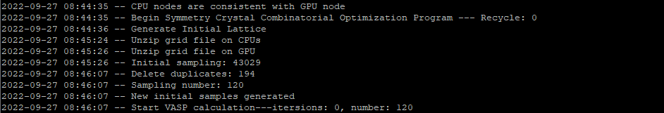
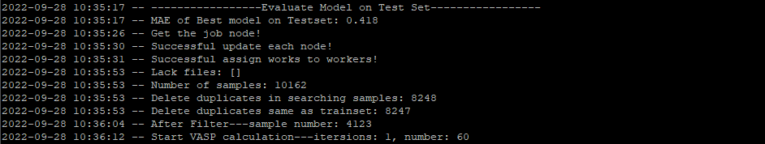
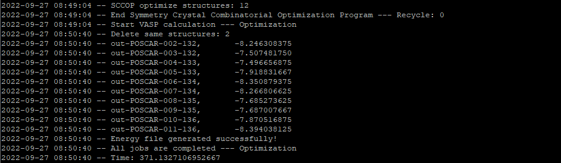

# Symmetry Crystal Combinatorial Optimization Program

This software package implements the Symmetry Crystal Combinatorial Optimization Program (SCCOP) that predicts crystal structure of specific composition. 

SCCOP combines graph neural network and DFT calculation to accelerate the search of crystal structure.
The following paper describes the details of the SCCOP framework:

[Crystal structure prediction and property related feature extraction by graph deep learning](XXX)


SCCOP now only supports the search for 2D materials, and the supporting for 3D is under construction.

## Table of Contents

- [How to cite](#how-to-cite)
- [Prerequisites](#prerequisites)
- [Usage](#usage)
  - [Confiugration](#server-and-absolute-path-configuration)
  - [Customize initial search file](#define-a-customized-search-file)
  - [Submit sccop job on cluster](#submit-sccop-job)
  - [Successful example](#successful-example)
- [Data](#data)
- [Authors](#authors)
- [License](#license)

## How to cite

Please cite the following work if you want to use SCCOP.

```
@article{XXX,
  title = {Crystal structure prediction and property related feature extraction by graph deep learning},
  author = {Li, Chuannan and Liang, Hanpu and Zhang, Xie and Lin, Zijing and Wei, Su-Huai},
  journal = {XXX},
  volume = {XXX},
  issue = {XXX},
  pages = {XXX},
  numpages = {XXX},
  year = {XXX},
  month = {XXX},
  publisher = {XXX},
  doi = {XXX},
  url = {XXX}
}
```

##  Prerequisites

Package requirements:

- [PyTorch (1.8.1)](http://pytorch.org/)
- [scikit-learn (1.0.1)](http://scikit-learn.org/stable/)
- [pymatgen (2022.5.26)](http://pymatgen.org/)
- [VASP (5.4.4)](https://www.vaspweb.org/)
- [DPT (0.8.3)](https://github.com/HanpuLiang/Data-Processing-Toolkit)
- [paramiko (2.7.2)](https://www.paramiko.org/)

Hardware requirements:

- [GPU node](https://en.wikipedia.org/wiki/GPU_cluster)
- [CPU node](https://en.wikipedia.org/wiki/Server_(computing))

## Usage
### Server and Absolute Path Configuration
In SCCOP, we use shell command `ssh` and `scp` to transfer files between nodes, you should make sure the `ssh` between nodes without password, here we provide one way as follows:

```bash
cd ~/.ssh
ssh-keygen -t rsa -b 4096
ssh-copy-id -i ~/.ssh/id_rsa.pub user@nodeXXX
```

Then, you need to specify server info and absolute path in `src/core/path.py`, thus GPU node can send jobs to cpu nodes via `paramiko`.

```diff
[Server]
# GPU number and name of gpu node
num_gpus = 2 
gpu_node = 'node151'
# List of cpu nodes, thus the cpu name is, e.g., 'nodeXXX' 
nodes = [131, 132, 133, 134, 135, 136] 

[Absolute path]
# Path of SCCOP on GPU node
SCCOP_path = '/local/sccop' 
# Directory of SCCOP on CPU nodes
CPU_local_path = '/local' 
# Path of VASP 2d and VASP 3d
VASP_2d_path = '/opt/openmpi-1.6.3/bin/mpirun' 
VASP_3d_path = '/opt/intel/impi/4.0.3.008/intel64/bin/mpirun' 
# VASP parallelization
VASP_2d_exe = f'{VASP_2d_path} -np 48 vasp_relax_ab' 
VASP_3d_exe = f'{VASP_3d_path} -np 48 vasp' 
```

**Note:** we recommend that you put SCCOP under the `/local` directory to accelerate the speed of data processing. For researchers who want to change the submission of VASP jobs, see the code in `src/core/sub_vasp.py`.

### Define a Customized Search File

To run SCCOP, you will need to define a customized initial search file, i.e., the `src/core/global_var.py` should be:

```diff
[Grid]
# Cut off distance to find neighbor atoms
cutoff = 8 
# Number of atoms in unit cell
num_min_atom = 5 
num_max_atom = 10 
# Grain of grid
grain = [.5, .5, 1.2] 
# Number of gridlines in a, b, c direction
plane_upper = [100, 100, 1]

[Dimension]
# Dimension of target composition
num_dim = 2 
# Whether add vacuum layer
add_vacuum = True 
vacuum_space = 15 
# Whether search puckered structure
puckered = True 
thickness = 0.1 

[Recycling]
# Number search recycle
num_recycle = 1 
# List of ML search and optimize in each recycle
num_ml_list = [1] 
# Number of structures that sent to VASP optimize
num_poscars = 12 
# High accuracy optimized by VASP
num_optims = 6 
# VASP time limit
vasp_time_limit = 480 

[Initial Samples]
# The chemical formula of the compound, e.g., 'B1C3'
component = 'XXX' 
# Number of initial lattice
num_latt = 72 
# Number of initial structures sent to VASP
num_Rand = 120 
# Average space group per crystal system
num_ave_sg = 10 
# Number of sampling structure = num_cores*num_per_sg
num_cores = 4  
num_per_sg = 5 
# Lattice parameters
len_mu = 5 
len_lower = 4 
len_upper = 6 
len_sigma = 1 
ang_mu = 90 
ang_sigma = 20 
# Sampling weight of crystal system
# [triclinic, monoclinic, orthorhombic, tetragonal, trigonal, hexagonal, cubic]
system_weight = [1/4, 0, 1/4, 1/4, 0, 1/4, 0] 

[Training]
# Training prediction model parameters
train_batchsize = 64 
train_epochs = 120 
use_pretrain_model = True 

[Searching]
# SA parameters
T = .1 
decay = .95 
# Total SA steps = latt_steps*sa_steps
latt_steps = 3 
sa_steps = 100 
# Metropolis judge interval
num_jump = 2 
# Number of SA path
num_path = 360
# SA cores
sa_cores = 2 
# Distance constraint
min_bond = 1.2 

[Sample Select]
# Number of models to predict energy
num_models = 5 
# TSNE components
num_components = 2 
# Number of clusters
num_clusters = 60 
ratio_min_energy = 0.5 
```

### Submit SCCOP Job

To submit the SCCOP job, you need to download the `data`, `libs` and `src` directory, and make a directory named sccop under `/local`.
If you finish the [configuration](#server-and-absolute-path-configuration) and [initial file](#define-a-customized-search-file), then you can `cd /local/sccop` to submit sccop by the command `nohup python src/main.py >& log&`.

After searching, you will get three important files.

- `log`: stores the searching process of SCCOP.
- `data/poscars/optim_strus`: stores the searched structures.
- `data/vasp_out/Energy-XXX.dat`: stores the average energy of searched structures.

**Note**: if you 

### Successful Example

Initial sampling structures by symmetry.


Update prediction model and optimize structures by ML-SA.


Optimize structures by VASP.


The log file and corresponding data are stored in `/examples/B1C3_log.dat`.

## Data

We have applied SCCOP to systematic search of B-C-N system, and you can download the corresponding data from [BCN_data](XXX).

## Authors

This software was primarily written by Chuannan Li and Hanpu Liang. 

## License

SCCOP is released under the MIT License.