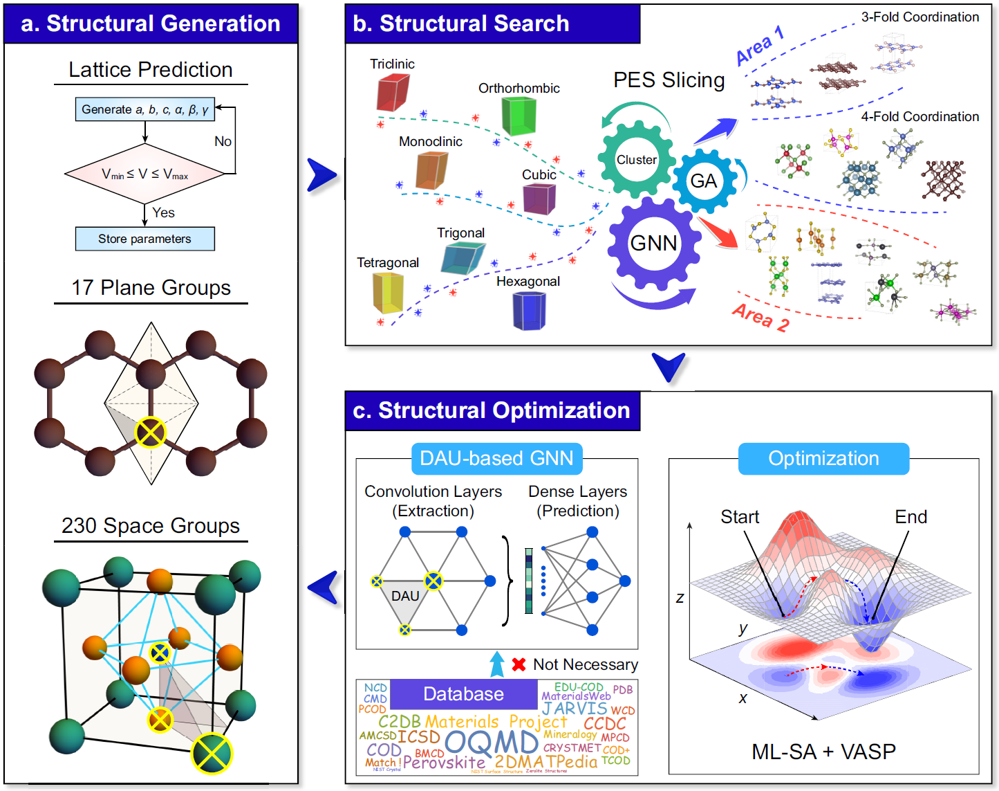

# Symmetry-based Combinatorial Crystal Optimization Program (SCCOP)

This software package implements the Symmetry-based Combinatorial Crystal Optimization Program (SCCOP) that predicts crystal structure of specific composition. 

SCCOP combines graph neural network and DFT calculation to accelerate the search of crystal structure.
The following paper describes the details of the SCCOP framework:



## Table of Contents

- [How to cite](#how-to-cite)
- [Prerequisites](#prerequisites)
- [Usage](#usage)
  - [Confiugration](#server-and-absolute-path-configuration)
  - [Customize initial search file](#define-a-customized-search-file)
  - [Submit SCCOP job on cluster](#submit-sccop-job)
  - [Successful example](#successful-example)
- [Data](#data)
- [Authors](#authors)
- [License](#license)

## How to cite

Please cite the following works if you want to use SCCOP.

```
@article{SCCOP,
    title = {Minimizing the training dataset for efficient crystal structure prediction by graph neural network},
    author = {Li, Chuan-Nan and Liang, Han-Pu and Xu, Si-Yuan and Zhang, Xie and Wei, Su-Huai and Lin, Zijing},
    journal = {submitted to Nat. Comput. Sci.}
}
```

##  Prerequisites

Package requirements:

- [PyTorch (1.8.1)](http://pytorch.org/)
- [scikit-learn (1.0.1)](http://scikit-learn.org/stable/)
- [pymatgen (2022.5.26)](http://pymatgen.org/)
- [VASP (5.4.4)](https://www.vaspweb.org/)
- [DPT (0.8.3)](https://github.com/HanpuLiang/Data-Processing-Toolkit)
- [paramiko (2.7.2)](https://www.paramiko.org/)

Hardware requirements:

- [GPU node](https://en.wikipedia.org/wiki/GPU_cluster)
- [CPU node](https://en.wikipedia.org/wiki/Server_(computing))

## Usage
### Server and Absolute Path Configuration
In SCCOP, we use shell command `ssh` and `scp` to transfer files between nodes, you should make sure the `ssh` between nodes without password, here we provide one way as follows:

```bash
cd ~/.ssh
ssh-keygen -t rsa -b 4096
ssh-copy-id -i ~/.ssh/id_rsa.pub user@nodeXXX
```

```diff
[Server]
# PBS or SLURM
Job_System = 'PBS'
Job_Queue = 'CPU'
# Obtain node information automatically
Host_Node = 'HOST_NODE'
CPU_Nodes = 'CPU_NODES'
GPU_Nodes = 'GPU_NODES'
Num_GPUs = 'GPU_NUM'

[Environment]
SCCOP_Env = ''
Sources = ''
Modules = ''
Envs = ''

[Absolute path]
# VASP settings
VASP_scf = '/opt/intel/impi/4.0.3.008/intel64/bin/mpirun -np 4 vasp'
VASP_opt = '/opt/intel/impi/4.0.3.008/intel64/bin/mpirun -np 48 vasp'
# LAMMPS settings
LAMMPS_scf = 'lmp_intel_cpu_intelmpi -in input.inp'
LAMMPS_opt = 'mpirun -np 96 lmp_intel_cpu_intelmpi -in input.inp'
```

**Note:** the SCCOP should under the `/local` directory of GPU node, e.g., `/local/sccop` which includes `sccop/src`, `sccop/data` and `sccop/libs`. For researchers who want to change the submission of VASP jobs, see the code in `src/core/sub_vasp.py`.

### Define a Customized Search File

To run SCCOP for desired composition, you need to define a customized initial search file, i.e., the `src/core/global_var.py` should be:

```diff
#Base
Dimension = 3
Composition = 'C1'
Num_Atom = [5, 10]
Space_Group = [[1, 230]]

#2-Dimension settings
Vacuum_Space = 15
Thickness = 1
Z_Layers = 3

#3-Dimension settings
Pressure = 0

#Model
Use_Pretrain_Model = False
Update_ML_Model = True

#Recycling
Num_Recycle = 1
Num_ML_Iter = [1]
Energy_Convergence = -1
Use_Succeed = True

#Sampling
Use_ML_Clustering = True
Min_Dis_Constraint = True
Init_Strus_per_Node = 20
Num_Sample_Limit = 50000
Sampling_Time_Limit = 120
Rand_Latt_Ratio = 0.8
#SpaceGroup-based
General_Search = True
Latt_per_Node = 40
SG_per_Latt = 5
#Cluster-based
Cluster_Search = False
Clus_per_Node = 10
Cluster_Num_Ratio = 0.8
Cluster_Weight = [1]
#Tempelate-based
Template_Search = False
Disturb_Seeds = False
Temp_per_Node = 20
Num_Fixed_Temp = 36

#Searching
SA_Path_per_Node = 40
Restart_Times = 10
Exploration_Ratio = .2
Exploitation_Num = 10
SA_Steps = 75
SA_Decay = .97
SA_Path_Ratio = 0.2

#Sample select
SA_Strus_per_Node = 10
SA_Energy_Ratio = 0.5

#Energy calculate
Energy_Method = 'VASP'
Num_Opt_Low_per_Node = 2
Num_Opt_High_per_Node = 1
Refine_Stru = False
Scf_Time_Limit = 72000
Opt_Time_Limit = 72000
#VASP 
Use_VASP_Scf = True
Use_VASP_Opt = True
VASP_Opt_Symm = True
#LAMMPS
Use_LAMMPS_Scf = True
Use_LAMMPS_Opt = True
```

### Job Script
SCCOP supports the PBS and SLURM job system, we offer the job script here.

For PBS job system
```bash
#!/bin/bash
#PBS -N sccop_pbs
#PBS -q queue
#PBS -l nodes=6:ppn=48
#PBS -l walltime=999:00:00
work=$PBS_O_WORKDIR
cd $work
rm -r output
mkdir output
#get info about host and computation nodes
host=`hostname`
nodes=`cat $PBS_NODEFILE | tr ' ' '\n' | sort | uniq`
echo $host > data/host.dat
echo $nodes > data/nodes.dat
#copy neccessary files to each node
for node in $nodes
do
	ssh -T $node "
		cd /tmp;
		rm -rf sccop;
		mkdir sccop;
		cd sccop;
		scp -r ${work}/data .;
		scp -r ${work}/libs .;
		scp -r ${work}/src .
		"
done
#launch sccop on host node
ssh -T $host "
	cd /tmp/sccop;
	python src/core/job_system.py;
	python src/main.py;
	scp data/log.sccop ${work}/.
	scp data/poscar/optim_strus/POSCAR* ${work}/output/.
	scp data/vasp_out/optim_strus/Energy.dat ${work}/output/.
	scp -r data/poscar ${work}/output/.
	"
#delete temporary files
rm data/host.dat
rm data/nodes.dat
```

For SLURM job system
```bash
#!/bin/bash
#SBATCH -J sccop
#SBATCH -o sccop_%j.out
#SBATCH -e sccop_%j.err
#SBATCH -p partition
#SBATCH -N 3
#SBATCH -n 288
work=$SLURM_SUBMIT_DIR
cd $work
rm -r output
mkdir output
#get info about host and computation nodes
nodes=$(scontrol show hostname $SLURM_JOB_NODELIST)
host=$(echo $nodes | awk '{print $1}')
echo $host > data/host.dat
echo $nodes > data/nodes.dat
#copy neccessary files to each node
for node in $nodes
do
	ssh -T $node "
		cd /tmp;
		rm -rf sccop;
		mkdir sccop;
		cd sccop;
		scp -r ${work}/data .;
		scp -r ${work}/libs .;
		scp -r ${work}/src .
		"
done
#launch sccop on host node
ssh -T $host "
	cd /tmp/sccop
	python src/core/job_system.py
	python src/main.py
	scp data/log.sccop ${work}/output/.
	scp data/poscar/optim_strus/POSCAR* ${work}/output/.
	scp data/vasp_out/optim_strus/Energy.dat ${work}/output/.
	scp -r data/poscar ${work}/output/.
	"
#delete temporary files
rm data/host.dat
rm data/nodes.dat
```

### Submit SCCOP Job

If you install packages in [prerequisites](#prerequisites), and finish the [server and path configuration](#server-and-absolute-path-configuration) and [initial search file](#define-a-customized-search-file), then you can `cd /path/sccop` to submit sccop job by:

```bash
# PBS job system
qsub jobs.pbs
# SLURM job system
sbatch job.slurm
```

After searching, you will get three important files.

- `data/log.sccop`: stores the searching process of SCCOP.
- `data/poscars/optim_strus`: stores the POSCAR of searched structures.

## Data

We have applied SCCOP to systematic search 82 compositions of B-C-N system, and you can download the newly discovered 28 stable low energy configurations from [B-C-N_POSCAR](examples/BCN.zip).

## Authors

This software was developed by SCCOP group. 

## License

SCCOP is released under the MIT License.